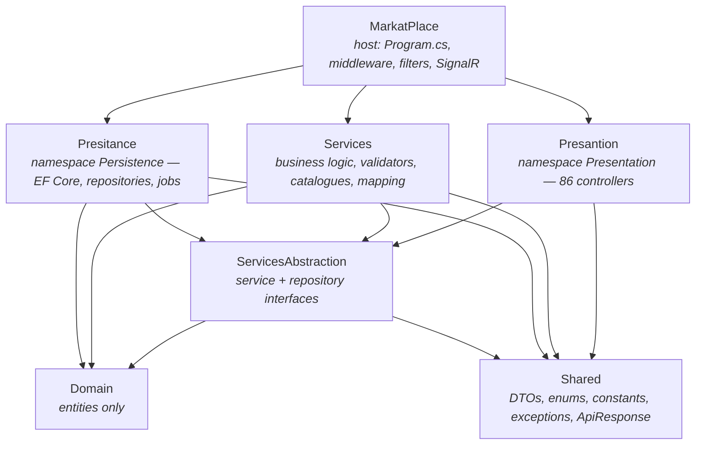

# MarkatPlace — Backend

The backend for **ماركت بليس**, a classified-advertisements marketplace for the **Fayoum
governorate (الفيوم)** in Egypt. It is an ASP.NET Core 10 Web API serving 12 advertisement
categories across 48 independent listing modules, an administration dashboard, real-time
notifications, and an Arabic-first user experience.

Everything a customer reads — every success message, every validation error, every notification and
every e-mail — is written in Egyptian Arabic. That is a hard product rule, not a preference. See
[CONVENTIONS.md § User-facing language](docs/CONVENTIONS.md#user-facing-language).

---

## What problem it solves

Fayoum has no single place to buy, sell, hire or ask locally. MarkatPlace is that place: a seller
posts a car, a plot of land, a flock of sheep or a job vacancy through one form; an administrator
reviews it; buyers browse, filter, favourite, rate and report it. Around the classifieds sit a
Lost & Found board, a charity portal (rescue calls, blood requests, ask-and-advise), a paid banner
marketplace and a referral programme.

Two properties shape the whole codebase:

- **Nothing is published unreviewed.** Every listing is created `قيد المراجعة` (pending) and only an
  administrator's approval makes it public. Editing a live listing sends it straight back to review.
- **Every module is independent.** 48 listing types, each with its own table, repository, service,
  controller, validator and lookups — held together by shared *seams* rather than by a shared base
  class. See [ARCHITECTURE.md](docs/ARCHITECTURE.md).

---

## Technology

| Layer | Technology |
| --- | --- |
| Runtime | .NET 10 / ASP.NET Core Web API |
| Language | C# 13, nullable reference types enabled |
| Database | SQL Server, EF Core 10 (code-first, 56 migrations) |
| Identity | ASP.NET Core Identity + JWT bearer tokens |
| Validation | FluentValidation 12 (global action filter, HTTP 422) |
| Mapping | AutoMapper 16 (one profile per module) |
| Real-time | SignalR (`/hubs/notifications`) |
| E-mail | MailKit / MimeKit (password-reset OTP) |
| API docs | Swashbuckle 9 — two OpenAPI documents (`v1`, `v2`) |
| Tests | xUnit (`Tests/MarkatPlace.Tests`, 1,532 tests) |

---

## High-level architecture

Onion architecture. Dependencies point inward; the domain knows nothing about HTTP or EF Core.



> **Note the spelling.** Two project folders are misspelled — `Infastrucre/Presitance` and
> `Infastrucre/Presantion` — but their **namespaces are correct** (`Persistence`, `Presentation`).
> This is deliberate and documented; see [DECISIONS.md § D-01](docs/DECISIONS.md#d-01-the-misspelled-project-folders-stay).

---

## Main features

| Area | What it does |
| --- | --- |
| **48 listing modules** | 12 categories → 52 sub-categories. Cars, Workshops & Craftsmen, Lost & Found, Business, Jobs, Animals, Antiques, Clothing, Online Shopping, Home Furnishing, Real Estate, Charity |
| **Dynamic forms** | `GET /api/lookups/create-ad-form/{cat}/{sub}` returns fields, conditional rules, lookups and the submit endpoint. The frontend holds **zero** business logic |
| **Moderation** | Every listing created pending; approve / reject / suspend; edits return to review automatically |
| **Publication window** | 30 days from approval; expiry is derived from `ExpireAt`, not from a status column |
| **Cross-module interactions** | Views, favourites, ratings (1–5), comments, reports, recently-viewed — one implementation for all modules |
| **Notifications** | Persisted + pushed over SignalR; category-interest subscriptions fan out new listings |
| **Admin dashboard** | Separate `api/v2/admin` surface with per-page permission grants |
| **Banner marketplace** | Advertisers book placements; admin approves the booking and the payment |
| **Referrals** | Invite links, one referrer per account, enforced by a unique index |

Full detail: [MODULES.md](docs/MODULES.md).

---

## Repository layout

```
MarkatPlace.slnx              Solution (7 projects + test project)
├── Core/
│   ├── Domain/               Entities only. No EF, no HTTP.
│   ├── ServicesAbstraction/  Interfaces for services and repositories.
│   └── Services/             Business logic, validators, catalogues, mapping profiles.
├── Infastrucre/
│   ├── Presitance/           namespace Persistence — DbContext, configurations,
│   │                         repositories, migrations, background jobs.
│   └── Presantion/           namespace Presentation — controllers only.
├── Shared/                   DTOs, enums, constants/catalogues, exceptions, ApiResponse.
├── MarkatPlace/              Host: Program.cs, middleware, filters, SignalR, wwwroot.
├── Tests/MarkatPlace.Tests/  xUnit test project.
└── fix-migration-history.sql One-off repair script (see TROUBLESHOOTING.md).
```

Detailed folder-by-folder guidance: [PROJECT_STRUCTURE.md](docs/PROJECT_STRUCTURE.md).

---

## Quick start

Full walkthrough with prerequisites and verification: **[SETUP.md](docs/SETUP.md)**.

```bash
# 1. Restore + build
dotnet build MarkatPlace.slnx

# 2. Point at a LOCAL database — appsettings.json's DefaultConnection is a SHARED hosted database.
export ConnectionStrings__DefaultConnection='Server=(localdb)\MSSQLLocalDB;Database=MarkatPlaceDev;Trusted_Connection=True;MultipleActiveResultSets=True;TrustServerCertificate=True'

# 3. Run. Migrations are applied automatically on start-up.
cd MarkatPlace && dotnet run

# 4. Open Swagger
#    https://localhost:7139/swagger   (or http://localhost:5002/swagger)
```

> ⚠️ **Never run against `appsettings.json`'s default connection string.** It points at the shared
> hosted database. Always override `ConnectionStrings__DefaultConnection` locally.

### Configuration

Configuration is layered: `appsettings.json` → `appsettings.{Environment}.json` → environment
variables (section separator `__`). No secret belongs in a committed file.

| Setting | Required in production | Notes |
| --- | --- | --- |
| `ConnectionStrings__DefaultConnection` | ✅ | SQL Server connection string |
| `JwtSettings__SecretKey` | ✅ **start-up fails without it** | ≥ 32 random characters |
| `EmailSettings__Password` | ✅ | SMTP password for password-reset e-mails |
| `AdminUser__*` | Bootstrap only | Creates the first administrator, then remove |
| `DemoData__Enabled` | Development only | Seeds demo listings and images |
| `Diagnostics__SqlCounter` | Optional | Adds `X-Sql-Count` / `X-Elapsed-Ms` response headers |
| `RateLimiting__*` | Optional | Defaults: 600 req/min global, 20 req/min on auth |

See [SETUP.md § Configuration](docs/SETUP.md#5-configure-the-remaining-environment) and
[SECURITY.md § Secrets](docs/SECURITY.md#secrets-and-credentials).

### Run the tests

```bash
dotnet test Tests/MarkatPlace.Tests/MarkatPlace.Tests.csproj
```

1,532 tests, no database required, under one second. See [TESTING.md](docs/TESTING.md).

---

## Documentation index

| Document | Read it when you need to… |
| --- | --- |
| [SETUP.md](docs/SETUP.md) | Get the project running for the first time |
| [ARCHITECTURE.md](docs/ARCHITECTURE.md) | Understand the layers, seams and request pipeline |
| [PROJECT_STRUCTURE.md](docs/PROJECT_STRUCTURE.md) | Find where a piece of code belongs |
| [MODULES.md](docs/MODULES.md) | Understand a specific business module |
| [API.md](docs/API.md) | Call or extend the HTTP API |
| [DATABASE.md](docs/DATABASE.md) | Work with entities, migrations, indexes |
| [AUTHENTICATION.md](docs/AUTHENTICATION.md) | Understand login, JWT, refresh, password reset |
| [AUTHORIZATION.md](docs/AUTHORIZATION.md) | Understand roles, admin pages and permissions |
| [BUSINESS_RULES.md](docs/BUSINESS_RULES.md) | **Avoid breaking existing behaviour** |
| [DEVELOPMENT_GUIDE.md](docs/DEVELOPMENT_GUIDE.md) | Add a feature, module, endpoint or migration |
| [CONVENTIONS.md](docs/CONVENTIONS.md) | Write code that matches the project |
| [TESTING.md](docs/TESTING.md) | Run or write tests |
| [SECURITY.md](docs/SECURITY.md) | Review or harden security |
| [PERFORMANCE.md](docs/PERFORMANCE.md) | Understand the query and index decisions |
| [DEPLOYMENT.md](docs/DEPLOYMENT.md) | Deploy to IIS / production |
| [TROUBLESHOOTING.md](docs/TROUBLESHOOTING.md) | Fix something that is broken |
| [DECISIONS.md](docs/DECISIONS.md) | Understand *why* something odd exists before changing it |

---

## Where to start if you are new

1. **[SETUP.md](docs/SETUP.md)** — get it running and open Swagger.
2. **[ARCHITECTURE.md](docs/ARCHITECTURE.md)** — read the "Seams" section. It explains why 48 modules
   do not mean 48 copies of everything.
3. **[BUSINESS_RULES.md](docs/BUSINESS_RULES.md)** — read the moderation and ownership rules before
   touching any listing code.
4. **Pick one module and read it end to end.** `أراضي` (Land) is the best example: it has every
   feature a module can have — conditional fields, multi-selects, video, discovery strips, price
   statistics. Follow `LandsController` → `LandService` → `LandRepository`.
5. **[DEVELOPMENT_GUIDE.md](docs/DEVELOPMENT_GUIDE.md)** before writing your first change.

---

## Development rules that matter

These are the ones that cause real damage when broken. The full list is in
[CONVENTIONS.md](docs/CONVENTIONS.md).

1. **Every customer-facing message is Egyptian Arabic**, written in
   `Shared/Constants/UserMessages.cs`. A source-scanning test fails the build if an English sentence
   reappears in a response.
2. **Never expose technical detail to a user** — no exception type, no SQL, no property name, no
   status-code name.
3. **A listing's moderation, publication window and promotion flags are server-owned.** They are
   ignored if they arrive in a request body.
4. **Business rules live in catalogues, not in controllers.** `AdFormSchemaCatalog`,
   `NotificationCatalog`, `ReadConfigCatalog`, `AdminPageCatalog` are single sources of truth.
5. **Drop query filters by name**, never with a bare `IgnoreQueryFilters()` — that would resurrect
   soft-deleted rows.
6. **Always read a scaffolded migration** before applying it. EF turns unrelated drop+add pairs into
   `RenameColumn` and silently reinterprets data.

---

## Security notice

> **Before the next production deployment**, read
> [SECURITY.md § Required production configuration](docs/SECURITY.md#required-production-configuration).
>
> The application **will refuse to start** in a non-Development environment unless
> `JwtSettings__SecretKey` is supplied as an environment variable. This is deliberate: a signing key
> that lives in a committed file is a signing key everybody has.
>
> Credentials that have ever been committed to this repository must be considered public and
> **rotated** — the database password and the SMTP password included.

---

## Deployment overview

Published to **IIS** (in-process, `AspNetCoreModuleV2`) with `MarkatPlace/web.config`. Migrations
apply automatically on start-up. Uploaded files live under `MarkatPlace/wwwroot/uploads/` and are
served as static files at permanent public URLs.

Health probes: `GET /health/live` (process) and `GET /health` (database). Both are exempt from rate
limiting.

Full procedure and checklist: [DEPLOYMENT.md](docs/DEPLOYMENT.md).

---

## Developer and Project Maintainer

**Abdullah Elbanna** — owner and maintainer of MarkatPlace.

| | |
| --- | --- |
| 📞 **Phone / WhatsApp** | [01026568617](https://wa.me/201026568617) |
| 💼 **LinkedIn** | [linkedin.com/in/abdullah-elbana](https://www.linkedin.com/in/abdullah-elbana/) |

Reach out for architectural decisions, production access, credential rotation, or anything in this
documentation that turns out to be wrong or incomplete.
