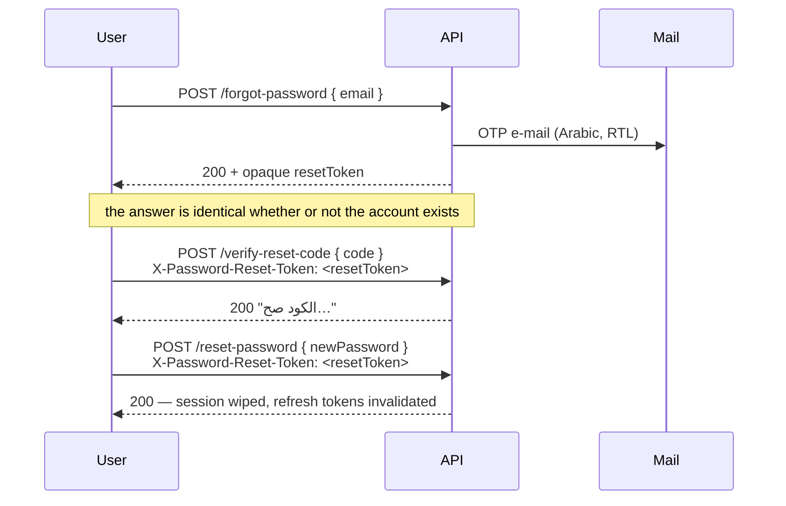

# Authentication

[← README](../README.md) · Related: [AUTHORIZATION](AUTHORIZATION.md) · [SECURITY](SECURITY.md) · [API](API.md) · [GOOGLE_SIGN_IN](GOOGLE_SIGN_IN.md)

ASP.NET Core Identity for account storage and password hashing; **JWT bearer tokens** for request
authentication. There are no cookies and no server-side session.

---

## Identity configuration

Configured in `Infastrucre/Presitance/DependencyInjection.cs` (`AddIdentityCore<ApplicationUser>`).

| Setting | Value |
| --- | --- |
| Password | ≥ 8 chars, requires digit, lowercase, uppercase, non-alphanumeric |
| Unique e-mail | Required |
| **Allowed username characters** | **Empty string — deliberately** |
| Lockout | 5 failed attempts → 15 minutes |
| Confirmed e-mail required to sign in | No |
| Roles | Enabled (`AddRoles<IdentityRole>`) |

> **Why `AllowedUserNameCharacters` is empty.** Identity's default whitelist is the ASCII set
> `a-zA-Z0-9-._@+`, which rejects every Arabic username outright — and would veto a name
> FluentValidation had already accepted, producing an Identity error instead of the platform's own
> Arabic message. Emptying it hands the decision to `AccountNameRules`, which is **stricter**: Arabic
> and Latin letters, digits, `.`, `_`, `-`, and single spaces between words. Nothing is let through
> that the validator has not already approved.

---

## Registration

```
POST /api/auth/register        anonymous        → 201
```

1. FluentValidation (`RegisterRequestValidator`) checks the payload: Egyptian mobile
   `^01[0-2,5]\d{8}$`, `center` ∈ the seven الفيوم مراكز, matching passwords, name rules.
2. Identity creates the user and hashes the password.
3. If a `referralCode` was supplied, the referral is written **in the account's own transaction**
   via `IUnitOfWork` — you cannot end up with an account and no referral, or the reverse.
4. Tokens are issued immediately; the response is the same `AuthResponse` as login.

**Uniqueness races.** Two concurrent registrations with the same phone used to produce a 500.
`IUnitOfWork.IsUniqueConstraintViolation` recognises SQL Server errors 2601/2627 and maps them to
**409** — without giving the core layer an EF reference.

---

## Login

```
POST /api/auth/login        { "username": "...", "password": "..." }
```

**Username, not e-mail.** Order of checks in `AuthService`:

1. `FindByNameAsync` → not found ⇒ `UnauthorizedException("اسم المستخدم أو كلمة السر غلط.")`
2. `IsLockedOutAsync` → locked ⇒ `UserMessages.Auth.AccountLocked`
3. `CheckPasswordAsync` → wrong ⇒ `AccessFailedAsync()` (counts towards lockout) and the **same**
   message as step 1

> Steps 1 and 3 answer identically on purpose. A different message would turn login into a way to
> discover which usernames exist.

---

## Google Sign-In

```
POST /api/auth/google        anonymous        → 200 (signed in) / 201 (account created)
GET  /api/auth/google/config anonymous        → { enabled, clientId }
```

An **addition** to password login, not a replacement. The browser obtains a Google **ID token**; the
API verifies it server-side with `Google.Apis.Auth` (signature against Google's keys, issuer,
expiry, and audience = `GoogleAuth:ClientId`) and answers with the **same `AuthResponse`** the
password login returns.

Identity is keyed on the Google **subject**, stored in Identity's own `AspNetUserLogins` — so **no
migration was needed**. An account is created only for a **verified** Google e-mail, and an existing
account is linked only when it owns that verified e-mail. Account status, lockout and roles follow
the password login's rules exactly.

A `referralCode` may travel with the credential; it is applied through the same `IReferralService`
calls registration uses, and **only** when a new account is created.

Full detail — the flow, the Google Console entries, the referral guarantees and the frontend
contract: **[GOOGLE_SIGN_IN.md](GOOGLE_SIGN_IN.md)**.

---

## The access token

Issued by `JwtService` (`Infastrucre/Presitance/Services/JwtService.cs`), signed **HMAC-SHA256**.

Claims:

| Claim | Value |
| --- | --- |
| `ClaimTypes.NameIdentifier` (`sub`) | User id — **the single source of caller identity** |
| `ClaimTypes.Name` | Username |
| `ClaimTypes.Email` | E-mail |
| `ClaimTypes.Role` | One per role held |

Validation parameters (`MarkatPlace/Extensions/JwtAuthenticationExtensions.cs`):

| Parameter | Value |
| --- | --- |
| `ValidateIssuer` / `ValidateAudience` | true — from `JwtSettings` |
| `ValidateIssuerSigningKey` | true |
| `ValidateLifetime` | true |
| `ClockSkew` | **`TimeSpan.Zero`** — no grace period |
| `RequireHttpsMetadata` | true outside Development |

### Lifetimes

| Token | Setting | Current value |
| --- | --- | --- |
| Access | `JwtSettings:AccessTokenExpirationDays` | **40 days** |
| Refresh | `JwtSettings:RefreshTokenExpirationDays` | **60 days** |

Both are expressed in **days**. Start-up refuses a configuration where access ≤ 0 or refresh ≤
access, because there would be no window in which an expired access token could be exchanged.

> ⚠️ A 40-day access token cannot be revoked before it expires. This is a deliberate
> long-session product decision — see [SECURITY.md](SECURITY.md#token-lifetimes).

### Signing key — start-up fail-fast

`appsettings.json` carries **no** `SecretKey`. Production must supply
`JwtSettings__SecretKey` as an environment variable. Start-up throws if the key is:

- missing or shorter than 32 bytes, **or**
- a known placeholder / previously-published value (checked outside Development only).

This is the single most important deployment requirement — see
[SECURITY.md § Required production configuration](SECURITY.md#required-production-configuration).

---

## Refresh tokens

Stored on `ApplicationUser`:

| Column | Purpose |
| --- | --- |
| `RefreshToken` | The current token (one per user) |
| `RefreshTokenExpiryTime` | Its expiry |

```
POST /api/auth/refresh-token     { "token": "<expired access>", "refreshToken": "<refresh>" }
```

`AuthService.RefreshTokenAsync` looks the user up **by refresh token**, then checks
`RefreshTokenExpiryTime`. Either failure answers **401** with the same message
(`"رمز التحديث مش صحيح أو انتهت صلاحيته."`).

One refresh token per user, so signing in elsewhere replaces it.

---

## Logout

```
POST /api/auth/logout        Authorization: Bearer <token>
```

Clears the stored refresh token. **The access token is not revoked** — there is no deny-list, so it
remains valid until it expires. That is the practical consequence of the 40-day lifetime.

---

## Password reset

A three-step session so the OTP cannot be replayed and the e-mail is never repeated on the wire.



| Step | Route | Carries |
| --- | --- | --- |
| 1 | `POST /api/auth/forgot-password` | `{ email }` → returns `resetToken` |
| 2 | `POST /api/auth/verify-reset-code` | `X-Password-Reset-Token` header + the OTP |
| 3 | `POST /api/auth/reset-password` | `X-Password-Reset-Token` header + the new password |

Rules enforced in `AuthService`:

- **No user enumeration** — step 1 answers identically for a known and an unknown address:
  *"لو البريد ده مسجّل عندنا، هيوصله كود…"*
- Step 3 refuses unless the OTP was verified **and** the verified window is still open
  (`UserMessages.Auth.ResetSessionExpired`).
- On success the **entire reset session is removed** and previously issued refresh tokens are
  invalidated — the token and OTP cannot be replayed.

The OTP e-mail is Egyptian Arabic, `dir="rtl"`, with the code itself kept LTR and centred so the
digits read correctly (`Presitance/Services/EmailService.cs`).

---

## Protected routes

| Attribute | Effect |
| --- | --- |
| `[Authorize]` on the controller | The default for listing controllers |
| `[AllowAnonymous]` on an action | Public reads — list, details, lookups, discovery strips |
| `[Authorize(Roles = AppRoles.Admin)]` | The whole `api/v2/admin` surface |

> **`[AllowAnonymous]` still authenticates.** `UseAuthentication` runs for every request, so a
> bearer token on an anonymous-allowed endpoint still populates `HttpContext.User`. This is what
> makes owner-aware visibility work on public details routes — see
> [BUSINESS_RULES § Owner visibility](BUSINESS_RULES.md#3-ownership-and-visibility).

### 401 vs 403

Both are produced by `JwtBearerEvents` in the API's own envelope, never as an empty body:

| Case | Status | Message |
| --- | --- | --- |
| No/invalid token on a protected route | **401** | `لازم تسجل دخولك عشان توصل للمحتوى ده.` |
| Valid token, insufficient role/permission | **403** | `مالكش صلاحية توصل للمحتوى ده.` |
| Resource exists but is not yours to see | **404** | Deliberately not 403 — a 403 would confirm the row exists |

---

## Role changes take effect immediately

A JWT carries the roles held **when it was issued**, so promoting a user to `Admin` would normally
leave them refused until they sign in again — the role claim is checked by `AuthorizationMiddleware`,
before any MVC filter runs.

`DatabaseRoleClaimsTransformation` (`IClaimsTransformation`, scoped) solves this: it rewrites the
principal's roles from `AspNetUserRoles` **inside the authentication middleware**, which is the only
point early enough. Backed by `IUserRoleCache` (singleton) — **uncached on the admin surface**,
cached elsewhere.
