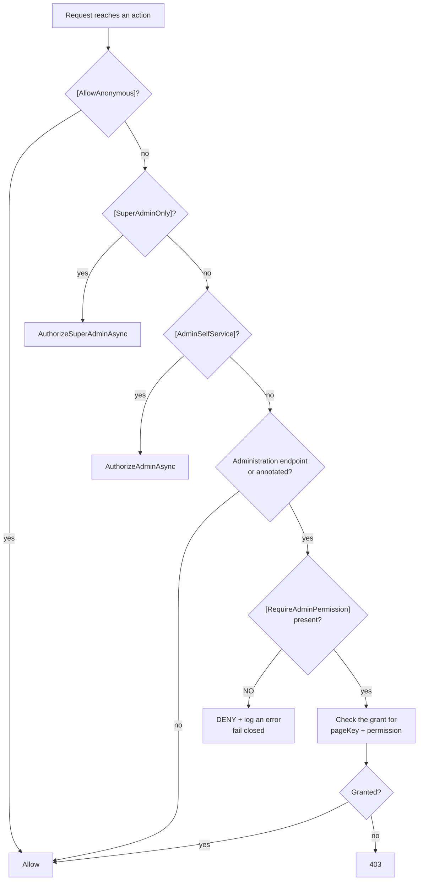

# Authorization

[← README](../README.md) · Related: [AUTHENTICATION](AUTHENTICATION.md) · [BUSINESS_RULES](BUSINESS_RULES.md) · [SECURITY](SECURITY.md)

Three independent layers decide what a caller may do:

1. **Roles** — `Admin`, `SuperAdmin` (`Shared/Constants/AppRoles.cs`)
2. **Per-page permissions** — for the admin dashboard only
3. **Ownership** — for listings, enforced in queries rather than by attributes

---

## Roles

| Role | Meaning |
| --- | --- |
| `Admin` | Any member of the administration. Gates the whole `api/v2/admin` surface |
| `SuperAdmin` | The owner of the administration: creates administrators, assigns pages and permissions, enables/disables them |

> **`SuperAdmin` is an addition, never a replacement.** Every Super Admin also holds `Admin`, so
> `[Authorize(Roles = AppRoles.Admin)]` keeps working unchanged. A Super Admin **bypasses per-page
> permission checks** — there is nothing to grant them, because they are who does the granting.

Ordinary users hold **no** role.

### How administrators are created

Administrators are **confirmed from existing users** — never created from scratch. The flow is a
candidate search followed by a promotion by user id. The only exception is the bootstrap account
`IdentityDataSeeder` creates from the `AdminUser` configuration section, which is absent from
production configuration on purpose.

Role changes take effect **immediately**, without a re-login — see
[AUTHENTICATION § Role changes](AUTHENTICATION.md#role-changes-take-effect-immediately).

---

## Per-page permissions

The dashboard is divided into **pages**. An administrator is granted a set of permissions **per
page**. Pages are declared in code; the database stores only who was granted what.

### The pages

`Shared/Constants/AdminPageCatalog.cs` — the only definition:

`dashboard` · `ads` · `users` · `categories` · `locations` · `banners` · `banner-requests` ·
`payments` · `reports` · `feedback` · `referrals` · `forms` · `home` · `settings` · `audit-logs`

A page is a **stable string key**, never a renumberable id. Grant rows reference it by that key.

### The permissions

`Shared/Enums/AdminPermissionEnums.cs` — a `[Flags]` enum:

| Permission | Value | Arabic |
| --- | --- | --- |
| `None` | 0 | — (never stored) |
| `View` | 1 | عرض |
| `Create` | 2 | إضافة |
| `Edit` | 4 | تعديل |
| `Delete` | 8 | حذف |
| `Approve` | 16 | قبول |
| `Reject` | 32 | رفض |
| `Manage` | 64 | إدارة |

**Each page declares only the permissions that mean something.** `ads` has `Approve` and `Reject`
because there are endpoints that approve and reject; `users` does not, because there are none. A
permission mapping to no endpoint would be a tick box granting nothing — worse than an absent one,
because it reads as authority the holder does not have.

### Storage

| Table | Contents |
| --- | --- |
| `AdminPageGrants` | `(UserId, PageKey)` — which pages an administrator has |
| `AdminPagePermissions` | The permissions on each grant |

Two tables rather than one bitmask column, because "who may delete advertisements" has to be a
**join**, not a bitwise scan.

> Grants are read **per request from the database**, never from the JWT. A permission change takes
> effect on the caller's next request.

---

## `AdminPermissionFilter` — how it is enforced

Registered as the **first** global action filter in `Program.cs`, so an unauthorised caller is
refused before their payload is validated, before a view is recorded and before any notification is
raised.



### It fails closed

An administration endpoint that declares **no** `[RequireAdminPermission]` is **refused**, and the
refusal is logged as an **error**. This is what makes "every sensitive admin operation is protected"
a property of the pipeline rather than a promise about code review: forgetting the annotation breaks
the endpoint in development instead of leaving it open in production.

### The attributes — `Shared/Authorization`

| Attribute | Applied to | Meaning |
| --- | --- | --- |
| `[AdminPage("ads")]` | Controller | Which page this controller belongs to |
| `[RequireAdminPermission(AdminPermission.Approve)]` | Action | The permission this action costs. May name its own page key |
| `[SuperAdminOnly]` | Action | Administrator management — Super Admin only |
| `[AdminSelfService]` | Action | "What am I allowed to do", an administrator's own notifications — any administrator |

`[AllowAnonymous]` wins, as everywhere in ASP.NET Core, so the filter can never break a public
endpoint that happens to live on an admin controller.

### Coverage

The filter runs on **V1 and V2 routes alike** — an admin action on a legacy `api/admin/*` controller
is checked too.

**Verified:** all 131 admin operations answer **401** to an anonymous caller and **403** to a
signed-in non-administrator ([TESTING.md](TESTING.md#coverage-achieved)).

---

## Ownership — listings

Ownership is **not** an attribute. It is enforced in the query, which fails closed: a mistake returns
fewer rows, never more.

### Reads

`ModerationQueryExtensions.VisibleToViewer(includeUnmoderated, viewerUserId)` — the single rule for
47 of the 48 modules:

```
(ModerationStatus == Approved AND (ExpireAt == null OR ExpireAt > UtcNow))
OR  UserId == viewerUserId
```

| Caller | Sees |
| --- | --- |
| Anonymous (`viewerUserId == null`) | Query returned untouched — the public filter stands |
| Signed-in stranger | The public rule only |
| **Owner** | The public rule **or** their own row, in any moderation state |
| Admin (`includeUnmoderated: true`) | Everything except soft-deleted |

Soft delete is a **separate named filter that nobody drops**, so a deleted listing is invisible to
its owner too.

سيارات states the same rule in `AdvertisementService` instead, because it has extra
window/status refusals of its own.

### Writes

| Operation | Rule |
| --- | --- |
| Create | Any signed-in user |
| Update / delete / reorder gallery | `GetOwnedAsync(id, userId)` (owner) or `includeUnmoderated: true` (admin) |
| Promotion (مميز / بريميوم / بيع سريع) | **Admin only** — the owner gets 403 |
| Moderation (approve / reject / suspend) | Admin only, via `api/v2/admin` |

### Where identity comes from

Always the authenticated principal's `NameIdentifier` claim:

- controllers: `User.FindFirstValue(ClaimTypes.NameIdentifier)`
- repositories: `AppDbContext.ViewerUserId` → `IAdminActionContext.UserId` → the same claim

**Never** from a query parameter, a route value, a header or a DTO field. Verified against ten IDOR
vectors ([TESTING.md](TESTING.md#coverage-achieved)).

---

## Quick reference

| Caller | Public listing | Own pending listing | Another's pending | Admin dashboard |
| --- | --- | --- | --- | --- |
| Anonymous | ✅ read | 404 | 404 | 401 |
| User | ✅ read | ✅ **read** | 404 | 403 |
| Owner | ✅ read + edit + delete | ✅ read + edit + delete | 404 | 403 |
| Admin | ✅ + moderate + promote | ✅ via `api/v2/admin` | ✅ via `api/v2/admin` | ✅ granted pages |
| Super Admin | as Admin | as Admin | as Admin | ✅ **all** pages |
