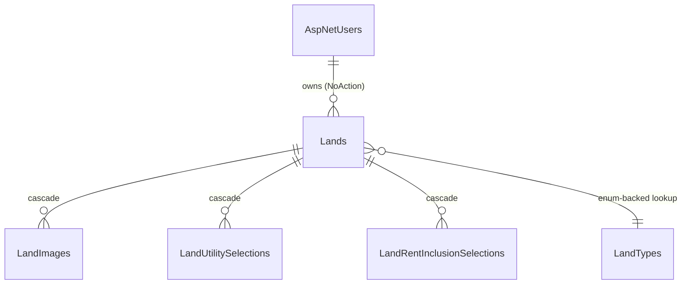

# Database

[← README](../README.md) · Related: [ARCHITECTURE](ARCHITECTURE.md) · [PERFORMANCE](PERFORMANCE.md) · [DEVELOPMENT_GUIDE](DEVELOPMENT_GUIDE.md)

**SQL Server** with **EF Core 10**, code-first. `AppDbContext` extends
`IdentityDbContext<ApplicationUser>` and exposes **369 `DbSet`s** across **56 migrations**.

---

## Shape of the schema

The schema is wide rather than deep. Most tables belong to one of these families:

| Family | Count (approx.) | Example |
| --- | --- | --- |
| Listing tables | 48 | `Lands`, `Camels`, `MenClothing` |
| Listing image tables | ~48 | `LandImages` |
| Module lookup tables | 200+ | `LandTypes`, `HorseVaccinations` |
| Multi-select selection tables | ~40 | `LandUtilitySelections` |
| Cross-module interaction tables | ~6 | `ListingViews`, `ListingFavorites`, `ListingRatings`, `ListingReports` |
| Identity | 7 | `AspNetUsers`, `AspNetRoles`, … |
| Platform | ~20 | `Notifications`, `Payments`, `Banners`, `Referrals`, `AdminAuditLogs` |

A module lookup table is `(Id, Name, NameAr)` seeded from a catalogue in `Shared/Constants` — the
code is the source of truth, the table is its materialisation.

---

## The listing entity shape

Every listing table carries the same three blocks on top of its own columns.



### 1. Ownership

```csharp
public string UserId { get; set; }
public ApplicationUser User { get; set; }
```

> **Foreign keys into `AspNetUsers` must use `DeleteBehavior.NoAction`.** 48 cascading relationships
> into the Identity table produce SQL Server error 1785 (*"may cause cycles or multiple cascade
> paths"*). There are 65 `NoAction` relationships in the model for this reason; 88 `Cascade`
> relationships exist between a listing and its own children, where cascading is correct.

### 2. Moderation — `IModeratedListing`

| Column | Notes |
| --- | --- |
| `ModerationStatus` | Required, **default `Pending` (0)** — so any insert path is unpublished |
| `ModeratedAt`, `ModeratedBy` | `ModeratedBy` is a plain `nvarchar(450)`, **not** a FK — an audit trail must survive the reviewer's account being deleted |
| `RejectionReason`, `ModerationNotes` | |

### 3. Publication window — `IExpiringListing`

| Column | Notes |
| --- | --- |
| `PublishedAt`, `ExpireAt` | **Nullable** — a listing has no window until it is approved |
| `FirstPublishedAt` | Anchors the free window across republishes |
| `RepublishCount` | Default 0 |

`null` means "not published yet", which is a different state from "finished".

All of this is applied by **`ModerationModelConfiguration.ApplyModerationConfiguration()`**, which
walks the model for `IModeratedListing` types. A module added tomorrow is moderated the moment its
entity implements the interface — no configuration change, and no chance of forgetting.

---

## Global query filters

Two, both **named** so one can be dropped without the other.

| Name | Predicate | Who drops it |
| --- | --- | --- |
| `SoftDelete` | `!IsDeleted` | **nobody** |
| `Moderation` | With a window: `ModerationStatus == Approved && (ExpireAt == null \|\| ExpireAt > GETUTCDATE())`<br>Without: `ModerationStatus == Approved` | `IncludingUnmoderated()`, `VisibleToViewer()`, `IncludingUnmoderatedParent()` |

> `DateTime.UtcNow` inside a filter translates to `GETUTCDATE()`, so the comparison happens in the
> database on every query. A listing stops being public **the moment its window closes**, not when a
> job next runs.

> **Never call bare `IgnoreQueryFilters()`.** It drops both filters and resurrects deleted rows.

### Soft delete

`IsDeleted` + `DeletedAt`. Nothing is hard-deleted through the API. A deleted listing is invisible to
everyone — its owner and administrators included.

---

## Important constraints

### Unique indexes (153 in the model)

| Index | Prevents |
| --- | --- |
| `Referrals (ReferredUserId)` unique | A user having two referrers |
| `ListingRatings (ListingType, ListingId, UserId)` unique | Rating the same listing twice — a second rating replaces the first |
| `ListingFavorites (ListingType, ListingId, UserId)` unique | Duplicate favourites |
| `ListingNotificationDispatches` unique | Announcing the same listing twice |
| `AdminPageGrants (UserId, PageKey)` unique | Duplicate grants |
| `AdFormFieldOverrides (CategoryId, SubCategoryId, FieldName)` unique | Two overrides for one field |
| Lookup `Name` unique | Duplicate reference rows |

> **A filtered unique index needs `HasFilter(null)`.** EF adds `WHERE [Col] IS NOT NULL` for a
> nullable column by default, which silently weakens the constraint.

Uniqueness races are caught rather than avoided: `IUnitOfWork.IsUniqueConstraintViolation`
recognises SQL Server errors **2601 / 2627** and maps them to **HTTP 409**, keeping EF out of the
core layer. This is also what makes double-tap favourite/rating idempotent instead of a 500.

### Check constraints

| Table | Rule |
| --- | --- |
| `Referrals` | No self-referral |
| `ListingRatings` | Stars between 1 and 5 |
| `PlatformSettings` | Single-row guard |

---

## Indexes

Roughly **1,266 indexes** exist across the database. The ones that matter:

| Index | Purpose |
| --- | --- |
| `(ModerationStatus, [IsPremium, IsFeatured,] CreatedAt, Id)` `INCLUDE (IsDeleted, ExpireAt)` | The visibility + ordering index every module's list is answered from. Declared once in `ModerationModelConfiguration` |
| `IX_<Table>_ExpireAt` | The window filter and the expiry job |
| `IX_Lands_Search` | Covering index for البحث / الفرز / إحصائيات الأسعار — see [PERFORMANCE](PERFORMANCE.md#the-land-search-covering-index) |
| Module filter indexes | One per column the module's filters use |

The composite ordering index is **descending on every sort column** and ends with the primary key,
so a page is an ordered read with no sort operator. Omitting the `Id` tie-breaker is enough to put
the sort back — measured at 353 logical reads / 39 ms versus 3 reads / < 1 ms.

> **Do not add indexes blindly.** Many single-column indexes on `bit` columns (`HasFence`,
> `IsOrganic`, `Negotiable`) have almost no selectivity and cost write throughput. Measure with
> `sys.dm_db_index_usage_stats` before adding or removing.

---

## Migrations

Located in `Infastrucre/Presitance/Migrations/` — 56 migrations plus `AppDbContextModelSnapshot.cs`.
Roughly 1.64 M generated lines; **never edit them by hand**.

Applied automatically on start-up (`db.Database.MigrateAsync()` in `Program.cs`).

### Adding one

```bash
cd Infastrucre/Presitance
dotnet ef migrations add <Name> --startup-project ../../MarkatPlace/MarkatPlace.csproj
cd ../.. && dotnet build            # REQUIRED — see below
```

> **Always `dotnet build` after `migrations add`.** The command builds the *pre*-migration state, so
> the binary on disk lacks the new migration and the next start-up dies with
> `PendingModelChangesWarning`.

> **Always read the scaffolded migration before applying it.** EF turns an unrelated drop + add pair
> into a `RenameColumn` and silently reinterprets the data. This has happened in this project.

A migration that is purely additive (a new index, a new nullable column) is safe. A migration that
drops or renames a column is not — see [DEVELOPMENT_GUIDE](DEVELOPMENT_GUIDE.md#changing-the-database).

---

## Seeding

| Seeder | When | Does |
| --- | --- | --- |
| EF `HasData` in configurations | Every migration | Lookup tables, from the `Shared/Constants` catalogues |
| `IdentityDataSeeder` | Every start-up | Ensures the roles exist; creates the bootstrap admin **only** if the `AdminUser` section is configured |
| `DevelopmentDataSeeder` | Development only | Downloads ~289 freely-licensed images once, seeds users/ads/workshops/craftsmen/posts. Idempotent; disable with `DemoData__Enabled=false` |

> **`IdentityDataSeeder` has no fallback credentials.** With `AdminUser` unset it seeds no account at
> all. That absence from production configuration *is* the safety mechanism.

> **EF store-generated-key gotcha:** when seeding demo data, add images through the `DbSet`, not
> through the parent's navigation collection.

---

## Performance-sensitive queries

| Query | Why | Where |
| --- | --- | --- |
| Module list page | Sorted + paged over the whole table | `PagedListingQuery.ToPageAsync` — key-first |
| Discovery strips (`similar`, `related`) | Sort on a computed expression | `PagedListingQuery.ToStripAsync` |
| Substring search | `LIKE N'%term%'` cannot seek | `IX_Lands_Search` narrows the scan |
| `ListingStatsFilter` batch | Would be a join per module | One batched query per response |

Details and measurements: [PERFORMANCE.md](PERFORMANCE.md).

---

## Inspecting a local database

```bash
sqlcmd -S "(localdb)\MSSQLLocalDB" -d MarkatPlaceDev -I -Q "SELECT COUNT(*) FROM Lands;"

# Arabic literals in a script file need the UTF-8 codepage:
sqlcmd -S "(localdb)\MSSQLLocalDB" -d MarkatPlaceDev -I -f 65001 -i script.sql
```

> Without `-f 65001`, `sqlcmd` reads a UTF-8 file as the ANSI codepage and stores mangled Arabic.
> `-I` sets `QUOTED_IDENTIFIER ON`, which inserts into tables with filtered indexes require.
