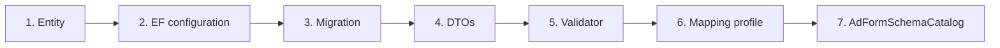

# Development Guide

[← README](../README.md) · Related: [CONVENTIONS](CONVENTIONS.md) · [BUSINESS_RULES](BUSINESS_RULES.md) · [PROJECT_STRUCTURE](PROJECT_STRUCTURE.md)

Recipes for the changes you will actually make. Follow the existing pattern rather than inventing one
— with 48 near-identical modules, consistency *is* the maintainability.

---

## Before you start

1. Read [BUSINESS_RULES.md](BUSINESS_RULES.md) for the area you are touching.
2. Check [DECISIONS.md](DECISIONS.md) — something that looks wrong is often deliberate.
3. Run the tests first, so you know they were green before you started:
   `dotnet test Tests/MarkatPlace.Tests/MarkatPlace.Tests.csproj`

---

## Adding a field to an existing module

The most common change. **Six places, in this order.**



1. **Entity** — `Core/Domain/Entities/<Category>/<Module>.cs`. Add the property. Nullable if the
   field is conditional. The Arabic label belongs in `AdFormSchemaCatalog`, not in a comment.
2. **EF configuration** — `Presitance/Configurations/<Category>/`. Set max length, precision, and an
   index only if a filter uses it.
   > A nullable `string`/`enum` on a required-by-default type needs an explicit `.IsRequired(false)`.
3. **Migration** — see [Changing the database](#changing-the-database).
4. **DTOs** — `Shared/DTOs/<Category>/<Module>/`: the create request, the update request, and the
   details DTO. Add it to the list item DTO **only if a card shows it**.
5. **Validator** — `Core/Services/Validation/`. Arabic message. If the field is conditional, use
   `.When(...)` mirroring the form's `requiredWhen`.
6. **Mapping profile** — usually automatic if the names match; add an explicit member map otherwise.
7. **`AdFormSchemaCatalog`** — add the field with its `type`, `label`, `required`,
   `requiredWhen` / `visibleWhen` and `optionsSource`.

> **Steps 5 and 7 must agree.** The form is what the client renders — a validator rule the form does
> not publish is a field the user is never given a chance to fill in, and a form rule the validator
> does not enforce is not a rule.

**Verify**

```bash
dotnet build MarkatPlace.slnx
dotnet test Tests/MarkatPlace.Tests/MarkatPlace.Tests.csproj
# then, against a running instance:
curl "http://localhost:5002/api/lookups/create-ad-form/11/47" | grep -o '"YourField"'
```

---

## Adding a new listing module

Substantial but mechanical. Copy the closest existing module — **`Land`** if it is feature-rich,
**`Bee`** if it is simple.

### 1. Domain

`Core/Domain/Entities/<Category>/<Module>.cs`:

```csharp
public class MyThing : IModeratedListing, IExpiringListing
{
    public Guid Id { get; set; }
    public string UserId { get; set; } = default!;
    public ApplicationUser User { get; set; } = default!;
    public ICollection<MyThingImage> Images { get; set; } = new List<MyThingImage>();
}
```

> Implementing the two interfaces is what enrols the module in moderation, the visibility filter, the
> ordering index and the publication window — automatically. No configuration change.
> The owner column **must** be named `UserId`; a guard test enforces this.

### 2. Persistence

- `Configurations/<Category>/<Module>Configurations.cs` — table, columns, soft-delete filter
  (`HasQueryFilter(QueryFilterNames.SoftDelete, x => !x.IsDeleted)`), filter indexes, lookup seeding.
  **FKs to `AspNetUsers` must be `DeleteBehavior.NoAction`.**
- `Repositories/<Module>Repository.cs` — copy the shape:

```csharp
public Task<MyThing?> GetByIdAsync(Guid id, bool asNoTracking = false,
    CancellationToken ct = default, bool includeUnmoderated = false)
{
    IQueryable<MyThing> query = _context.MyThings.Include(x => x.Images);

    query = query.VisibleToViewer(includeUnmoderated, _context.ViewerUserId);

    if (asNoTracking) query = query.AsNoTracking();
    return query.FirstOrDefaultAsync(x => x.Id == id, ct);
}
```

Use `PagedListingQuery.ToPageAsync` for the list and `ToStripAsync` for `similar`/`related`
(**not** for `recently-added` — see [PERFORMANCE](PERFORMANCE.md#discovery-strips)).

### 3. Contracts

- `Shared/Enums/<Category>/<Module>Enums.cs`
- `Shared/DTOs/<Category>/<Module>/` — create, update, list item, details, filter params
- `Shared/Constants/<Category>Catalog.cs` — Arabic lookup names + seed data
- A new `ListingModuleType` value — **append, never renumber**; gaps are cheaper than renumbering a
  published contract
- Register it in `ListingModuleCatalog`

### 4. Application

- `Core/ServicesAbstraction/I<Module>Repository.cs`, `I<Module>Service.cs`
- `Core/Services/<Category>/<Module>Service.cs`
- `Core/Services/Validation/<Module>RequestValidators.cs`
- `Core/Services/Mapping/<Module>MappingProfile.cs` — **register it** in
  `Services/DependencyInjection.cs`
- `AdFormSchemaCatalog` and `ReadConfigCatalog` entries
- `NotificationCatalog` entry

### 5. Presentation and DI

- `Infastrucre/Presantion/Controllers/<Module>Controller.cs`
- Register the repository and service in the two `DependencyInjection.cs` files
- `IUserListingSource` provider in `Presitance/Listings/` so it appears in `my-listings`

### 6. Migration, then verify

```bash
cd Infastrucre/Presitance
dotnet ef migrations add AddMyThingModule --startup-project ../../MarkatPlace/MarkatPlace.csproj
cd ../.. && dotnet build && dotnet test Tests/MarkatPlace.Tests/MarkatPlace.Tests.csproj
```

The guard tests will tell you if you missed the owner column or the visibility rule.

---

## Adding an endpoint

```csharp
[HttpGet("{id:guid}/thing")]
[AllowAnonymous]
[ProducesResponseType(typeof(ApiResponse<ThingDto>), StatusCodes.Status200OK)]
[ProducesResponseType(typeof(ApiResponse), StatusCodes.Status404NotFound)]
public async Task<ActionResult<ApiResponse<ThingDto>>> GetThing(Guid id)
{
    var result = await _service.GetThingAsync(id, HttpContext.RequestAborted);
    return Ok(ApiResponse<ThingDto>.Ok(result, UserMessages.Listings.DetailsLoaded));
}
```

Checklist:

- [ ] Message comes from `UserMessages` — **never a literal**
- [ ] `CancellationToken` is `HttpContext.RequestAborted`
- [ ] `[ProducesResponseType]` for every status you return
- [ ] Multipart endpoints carry `[Consumes("multipart/form-data")]` and `[RequestSizeLimit(...)]`
- [ ] No business logic in the controller
- [ ] If it is a read route, add it to `ReadConfigCatalog`

---

## Adding validation

```csharp
public class CreateMyThingRequestValidator : AbstractValidator<CreateMyThingRequest>
{
    public CreateMyThingRequestValidator()
    {
        RuleFor(x => x.Title)
            .NotEmpty().WithMessage("عنوان الإعلان مطلوب.")
            .MaximumLength(150);

        RuleFor(x => x.OtherType)
            .NotEmpty().WithMessage("من فضلك اكتب النوع عند اختيار 'أخرى'.")
            .When(x => x.Type == MyThingType.Other);
    }
}
```

Rules:

- Registered automatically by assembly scan — no manual registration.
- **Arabic messages only.** A source-scanning test fails the build otherwise.
- **Never put a C# property name in a message.** Use `OverridePropertyName` for the machine-readable
  key and an Arabic label in the text.
- A rule with no `WithMessage` falls back to `EgyptianArabicLanguageManager` — already Arabic.
- `NotNull` and `InclusiveBetween` must be **two separate `RuleFor` blocks**.

---

## Changing the database

```bash
cd Infastrucre/Presitance
dotnet ef migrations add <DescriptiveName> --startup-project ../../MarkatPlace/MarkatPlace.csproj
cd ../..
dotnet build            # REQUIRED
```

> **`migrations add` builds the *pre*-migration state**, so the binary on disk lacks the new
> migration and the next start-up dies with `PendingModelChangesWarning`. Always build afterwards.

### Read the scaffolded migration

Open `Migrations/<timestamp>_<Name>.cs` before applying it.

| Look for | Why |
| --- | --- |
| `RenameColumn` you did not intend | EF turns an unrelated drop + add pair into a rename and **silently reinterprets the data** |
| `DropColumn` | Destructive. Is the data needed? |
| An empty `Up()` | A scaffold produced against the wrong state — regenerate |

Additive migrations (new index, new nullable column) are safe. Anything destructive needs a written
justification.

Roll back an unapplied migration:

```bash
cd Infastrucre/Presitance
dotnet ef migrations remove --startup-project ../../MarkatPlace/MarkatPlace.csproj
```

---

## Adding tests

Tests live in `Tests/MarkatPlace.Tests` and are **hermetic** — no database, no host.

| Kind | Pattern |
| --- | --- |
| Validation | Instantiate the validator, call `Validate`, assert `IsValid` and that messages are Arabic |
| Catalogue invariant | Reflect over the catalogue and assert every entry |
| Model invariant | Reflect over `typeof(IModeratedListing).Assembly` |
| Source guard | Scan with `RepositoryRoot.SourceFiles()` |

```csharp
[Fact]
public void A_listing_a_real_seller_would_post_is_accepted()
{
    var result = new CreateMyThingRequestValidator().Validate(Valid());
    Assert.True(result.IsValid,
        string.Join(" | ", result.Errors.Select(e => e.ErrorMessage)));
}
```

> **Mutation-test a guard.** Reintroduce the bug, confirm the test fails, then revert. A guard that
> has never failed is a guard you cannot trust.

Behavioural rules that need a database are proven with HTTP suites against a running instance — see
[TESTING.md](TESTING.md#http-suites).

---

## Changing permissions

1. Add the page key to `AdminPageCatalog.Keys` and an entry to `All`, declaring **only** the
   permissions that map to real endpoints.
2. Annotate the controller `[AdminPage(AdminPageCatalog.Keys.MyPage)]`.
3. Annotate each action `[RequireAdminPermission(AdminPermission.Edit)]`.

No migration is needed — pages are code, grants are data. Forgetting step 3 makes the endpoint
**refuse everyone** and log an error; that is deliberate.

---

## Public vs admin functionality

| | Public (V1) | Admin (V2) |
| --- | --- | --- |
| Route | `api/<module>` | `api/v2/admin/<page>` |
| Controller folder | `Controllers/` | `Controllers/Admin/` |
| Swagger doc | `v1` (default) | `v2` via `[ApiExplorerSettings(GroupName = ApiVersions.AdminV2)]` |
| Authorization | `[Authorize]` / `[AllowAnonymous]` | `[Authorize(Roles = Admin)]` + page permission |
| Sees unapproved listings | No (except owners) | Yes |

> **Never add an admin capability to a V1 controller.** The split is what makes "no public endpoint
> can do an admin thing" a property of routing rather than of review.

---

## Patterns to follow

| ✅ Do | Why |
| --- | --- |
| Put wording in a catalogue | 48 modules; one edit instead of 48 |
| Throw `AppException` subclasses | The middleware maps them to status + Arabic message |
| Use `PagedListingQuery` for paged reads | Avoids re-sorting per `Include` |
| Drop query filters **by name** | A bare `IgnoreQueryFilters()` resurrects deleted rows |
| Add cross-cutting behaviour as a global filter | Covers all modules at once |
| Read the caller from claims | The only trustworthy source |

## Patterns to avoid

| ❌ Don't | Instead |
| --- | --- |
| Business logic in a controller | Put it in the service |
| EF queries in a service | Put them in the repository |
| `throw new NotFoundException` in a repository | Return `null`; let the service decide |
| An English message in a response | `UserMessages` |
| A hard-coded field list in a client or test | Read `create-ad-form` |
| A new "base module class" | The seams exist precisely to avoid one |
| `IgnoreQueryFilters()` with no arguments | `IncludingUnmoderated()` / `VisibleToViewer()` |
| An index "just in case" | Measure first — [PERFORMANCE](PERFORMANCE.md) |
| Editing a migration by hand | Regenerate it |

---

## Before you open a pull request

```bash
dotnet build MarkatPlace.slnx -c Release      # 0 errors, 0 warnings
dotnet test Tests/MarkatPlace.Tests/MarkatPlace.Tests.csproj
```

- [ ] No new warnings
- [ ] All tests pass
- [ ] No English in a customer-facing message
- [ ] No secret in a committed file
- [ ] The scaffolded migration was read
- [ ] `AdFormSchemaCatalog` and the validator agree
- [ ] [BUSINESS_RULES.md](BUSINESS_RULES.md) updated if a rule changed
