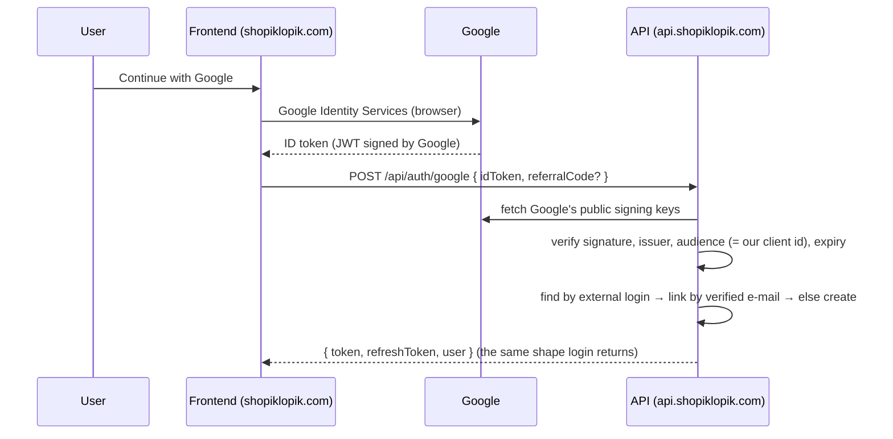

# Google Sign-In

[← README](../README.md) · Related: [AUTHENTICATION](AUTHENTICATION.md) · [SECURITY](SECURITY.md) · [API](API.md) · [DEPLOYMENT](DEPLOYMENT.md)

Google Sign-In is an **additional way into the existing account system**, not a second
authentication system. It ends in the same `AuthResponse` (access token + refresh token + `UserDto`)
that `POST /api/auth/login` returns, so the frontend keeps one auth state and one API client.

Email/password registration and login are untouched.

---

## The flow that was chosen, and why

**Google Identity Services in the browser → ID token → `POST /api/auth/google` → application JWT.**



**Why the ID-token flow rather than a backend redirect/callback.**

| | ID token (chosen) | Backend redirect + callback |
| --- | --- | --- |
| Google Console needs | An **Authorized JavaScript origin** only | A redirect URI, plus session/state handling |
| Client secret | **Not needed** | Needed |
| Extra round trips | None | Two redirects through the API host |
| Fits a token-only API | Yes — no cookie, no server session | Poorly — the callback lands on the API, not the site |

The API has no cookies and no server-side session ([AUTHENTICATION.md](AUTHENTICATION.md)); a browser
redirect flow would have had to invent one just to hand the token back to the site.

**The authorization-code path is also supported.** `POST /api/auth/google` accepts a `code` instead
of an `idToken`. The API then exchanges it at `https://oauth2.googleapis.com/token` using the client
id **and the client secret**, and verifies the `id_token` that comes back exactly as above. Use it if
you prefer Google's `initCodeClient` popup. That is the **only** thing the client secret is for.

---

## Google Cloud Console configuration

OAuth client type: **Web application**.

### Authorized JavaScript origins — required

| Environment | Origin |
| --- | --- |
| Production | `https://shopiklopik.com` |
| Production (www) | `https://www.shopiklopik.com` |
| Local development | `http://localhost:5173` |

Add every port a developer actually serves the site on (`http://localhost:3000`,
`http://localhost:4200`, …). Google matches the origin **exactly** — `localhost` and `127.0.0.1` are
different entries, and so are the apex and `www` hosts.

### Authorized redirect URIs

**The default ID-token flow needs none.** Leave the list empty unless you use the code flow.

If you use the authorization-code popup (`initCodeClient` with `ux_mode: 'popup'`), Google requires
the literal redirect value `postmessage`, which is **not** entered in the Console — it is what the
API sends in the exchange, and it is the committed default of `GoogleAuth:RedirectUri`.

Only a full-page code redirect needs a real callback URI in the Console. If you adopt one, it must
be a route the API actually serves; **this implementation exposes no such callback**, so do not add
one speculatively.

### OAuth consent screen

The API refuses to create an account from an unverified Google e-mail, so the consent screen must
request at least the `email`, `profile` and `openid` scopes.

---

## Configuration

| Key | Environment variable | Committed? | Purpose |
| --- | --- | --- | --- |
| `GoogleAuth:ClientId` | `GoogleAuth__ClientId` | ✅ in `appsettings.json` | Public. The audience every ID token is validated against |
| `GoogleAuth:ClientSecret` | `GoogleAuth__ClientSecret` | ❌ **never** | Only used for the authorization-code exchange |
| `GoogleAuth:RedirectUri` | `GoogleAuth__RedirectUri` | ✅ (`postmessage`) | Sent with the code exchange |
| `GoogleAuth:RequireVerifiedEmail` | `GoogleAuth__RequireVerifiedEmail` | ✅ (`true`) | Refuse an unverified Google e-mail |
| `GoogleAuth:LinkVerifiedEmailToExistingAccount` | `GoogleAuth__LinkVerifiedEmailToExistingAccount` | ✅ (`true`) | Link to an existing account that owns the same verified e-mail |

> **The client id is public on purpose.** The browser sends it to Google in the clear on every
> sign-in; hiding it in an environment variable would buy nothing and would make local development
> harder. The **secret** is what must never be committed — a test
> (`GoogleAuthConfigurationTests`) fails the build if a `GOCSPX-` value appears anywhere in the
> repository or in a committed configuration file.

With no `ClientId` configured the endpoint answers **400** `الدخول بحساب جوجل مش متاح دلوقتي.` and
`GET /api/auth/google/config` reports `enabled: false`, so the frontend can hide the button rather
than show one that cannot work.

---

## API

### `POST /api/auth/google` — anonymous

Rate-limited by the existing `auth` policy, like every other `api/auth` route.

```jsonc
{
  "idToken": "<the credential Google Identity Services returned>",  // or "code"
  "code": null,             // authorization code, if you use the code flow
  "redirectUri": null,      // overrides GoogleAuth:RedirectUri for the code exchange
  "referralCode": "ABC123", // optional — the ?ref= value from the invitation link
  "center": "سنورس"         // optional — one of the seven الفيوم مراكز
}
```

Exactly one of `idToken` / `code` is required.

| Status | When | Body |
| --- | --- | --- |
| **200** | Signed an existing user in | `ApiResponse<AuthResponse>` + `تم تسجيل الدخول بحساب جوجل بنجاح.` |
| **201** | Created a new account | `ApiResponse<AuthResponse>` + `تم إنشاء حسابك بحساب جوجل. أهلاً بيك في ماركت بليس.` |
| **400** | Neither credential sent, or the flow is not configured | Arabic validation errors |
| **401** | Invalid / expired / revoked / malformed credential, or an unverified Google e-mail, or a locked-out account | Arabic message |
| **403** | Account is `Blocked` or `Suspended` | The same message the password login gives |
| **409** | Linking is disabled and the e-mail already belongs to an account; or a concurrent sign-in lost a uniqueness race (retry) | Arabic message |

`AuthResponse` is the **same class** the password login returns — no separate model, no separate
token type. It never carries the Google credential, the Google subject, or anything Google-derived
beyond the profile fields that were copied onto the account.

### `GET /api/auth/google/config` — anonymous

```json
{ "success": true, "data": { "enabled": true, "clientId": "…apps.googleusercontent.com" } }
```

Publishes only what the browser needs. `GoogleAuthConfigDto` has exactly two properties, and a test
asserts that neither of them is a secret.

---

## What the backend does with a credential

1. **Verify.** `GoogleTokenValidator` calls `GoogleJsonWebSignature.ValidateAsync` from Google's own
   `Google.Apis.Auth` package. That checks the **signature against Google's published keys**, the
   **issuer**, the **expiry** (`ExpirationTimeClockTolerance = TimeSpan.Zero`, matching the JWT
   bearer's `ClockSkew = TimeSpan.Zero`) and the **audience against `GoogleAuth:ClientId`**. A token
   minted for another Google application is rejected. Nothing about the caller's claimed identity is
   trusted before this step — the request has **no** `email` field to trust in the first place.
2. **Find by external login.** `UserManager.FindByLoginAsync("Google", sub)` — the Google **subject**,
   not the e-mail, is the identity key. Found ⇒ sign in, no referral, no account creation.
3. **Require a verified e-mail.** Not verified ⇒ **401**, and nothing is created or linked. This is
   what stops e-mail-only account takeover: an attacker who puts a victim's address on a Google
   account they do not own cannot get it verified.
4. **Link an existing account.** If a user already owns that verified e-mail, the Google login is
   added to it (`AspNetUserLogins`) and that user is signed in. Their password still works. The
   account-status checks run **before** the link is written, so a blocked account never acquires one.
5. **Otherwise create.** A new `ApplicationUser` with `EmailConfirmed = true`, the governorate fixed
   to الفيوم, a unique referral code of its own, and **no password** — so the account cannot be
   entered by guessing. The user can set one later through the ordinary "forgot password" flow.

Account status, lockout and role rules are the password login's rules, reused: `EnsureAccountUsable`
throws the same `ForbiddenException` for a blocked/suspended account, lockout answers
`UserMessages.Auth.AccountLocked`, and the JWT is built by the same `BuildAuthResponseAsync` with
`UserManager.GetRolesAsync`, so an administrator signing in with Google is still an administrator.

### Names and usernames

Google supplies a display name, not the platform's `firstName` / `secondName` / `username`.

- `GoogleAuthCatalog.SplitDisplayName` derives the two names from `given_name` / `family_name`,
  falling back to the full name, then to the e-mail local part, then to `مستخدم`. When only one name
  exists, the second repeats it — both columns are `NOT NULL`.
- `GoogleAuthCatalog.SuggestUsername` derives a username from the e-mail local part (then the
  display name), sanitised against `AccountNameRules` — the **same** rule the registration validator
  enforces — and a numeric suffix is appended until it is free. An existing user's username is never
  taken.

Both are best-effort starting points; the user can correct them in the profile screen, which is also
where they add the phone number and the correct مركز (the new account defaults to `الفيوم`, or to the
`center` the frontend passes through from the sign-up screen).

---

## Referral / invitation codes

The referral system is **reused, not re-implemented**: `IReferralService.ResolveReferrerForRegistrationAsync`
and `IReferralService.RecordAsync`, the same two calls `AuthService.RegisterAsync` makes.

`https://shopiklopik.com/register?ref=ABC123` → the frontend keeps `ref` in its state → it is sent as
`referralCode` on `POST /api/auth/google`.

| Situation | Result |
| --- | --- |
| New account + valid code | One `Referrals` row, `Completed`, inviter notified once |
| New account + unknown or malformed code | Account created, **no** referral (the code is ignored, not an error) |
| New account + code of a blocked/suspended inviter | Account created, **no** referral |
| New account + the user's own code | Impossible — the account does not exist yet, and `RecordAsync` refuses a self-referral |
| **Existing** account signing in, code present | **No referral, ever** — the code is only read on the create path |
| The same Google login repeated | Step 2 finds the external login and returns before any referral code is looked at |

Three independent guards make double-crediting impossible:

1. The referral code is only read inside `CreateGoogleUserAsync`, which only runs when no user exists.
2. `IX_Referrals_ReferredUser` is **unique** — one referrer per referred user, enforced by the database.
3. `CK_Referrals_NoSelfReferral` rejects a self-referral row outright.

The account and its referral are written in **one transaction** (`IUnitOfWork.BeginTransactionAsync`),
exactly as password registration does, so you cannot end up with an account and no referral or the
reverse. Notifications — the welcome notification and the inviter's "someone joined" — are sent
**after** the commit, and the inviter's is idempotent (`ReferrerNotified` + `CreateIfNotExistsAsync`).

---

## Database

**No migration is required.** Google logins are stored in **`AspNetUserLogins`**, the table ASP.NET
Core Identity has created since the initial migration (`20260728103452_intialCreate`), keyed on
`(LoginProvider, ProviderKey)` = `("Google", <Google subject>)`. `AppDbContext` derives from
`IdentityDbContext<ApplicationUser>`, so the store and the `UserManager` external-login API were
already there — `dotnet ef migrations has-pending-model-changes` reports no change.

No Google access token or refresh token is stored. The ID token is verified and discarded; only the
subject, e-mail, name and `EmailConfirmed` reach the database.

---

## CORS

The API used to answer `AllowAnyOrigin`. It now answers a configured allow-list
(`MarkatPlace/Extensions/CorsExtensions.cs`, `Cors:AllowedOrigins`), which is what lets the browser
send credentialed requests from the site and nothing else. See
[SECURITY.md § CORS](SECURITY.md#cors) for the list, the escape hatch and what to do when a new
frontend origin appears.

---

## Frontend integration

> The site lives in its own repository; this repository is the API. The snippet below is the
> contract the API expects — drop it into the existing auth screen next to the email/password form.

Load Google Identity Services once (`https://accounts.google.com/gsi/client`), then:

```js
// 1. The client id comes from the API, so it is never duplicated in two places.
const { data } = await api.get('/api/auth/google/config');
if (!data.enabled) return;            // hide the button rather than show a broken one

// 2. The referral code survives the Google round trip because it never leaves the page.
const referralCode = new URLSearchParams(location.search).get('ref')
                  ?? sessionStorage.getItem('referralCode');

google.accounts.id.initialize({
  client_id: data.clientId,
  callback: async ({ credential }) => {
    // 3. The same API client, the same auth state as the password login.
    const response = await api.post('/api/auth/google', { idToken: credential, referralCode });
    auth.signIn(response.data);        // { token, refreshToken, user }
  },
});

google.accounts.id.renderButton(document.getElementById('google-button'), {
  theme: 'outline', size: 'large', text: 'continue_with', locale: 'ar', width: 320,
});
```

Rules for the frontend:

- **Never** put the client secret in frontend code. It is not needed for this flow and the frontend
  has no use for it.
- Persist `?ref=` **before** opening the Google popup (session storage is enough) and send it as
  `referralCode`. Sending it on a sign-in that turns out to be an existing account is harmless — the
  backend ignores it.
- Keep the email/password form exactly as it is; the Google button is an addition beside it.
- Treat **201** and **200** the same way for storing tokens; the difference only tells you whether to
  show "welcome" or "welcome back", and whether to route a brand-new user to the profile screen to
  add their phone number and مركز.
- Local development works as soon as `http://localhost:5173` is both an Authorized JavaScript origin
  in the Google Console and an entry in `Cors:AllowedOrigins`. Both are already configured.

---

## Tests

`Tests/MarkatPlace.Tests/GoogleSignInTests.cs` runs the real `AuthService`, the real
`ReferralService` and the real Identity `UserManager` over an in-memory database
(`GoogleSignInHarness`), with only the Google network call stubbed. It covers a valid sign-in, an
invalid credential, an expired credential, an unverified e-mail, an existing linked user, a new user,
an e-mail collision with a password account, blocked / suspended / locked-out accounts, referral
application, an invalid referral code, exactly-once crediting, repeated sign-ins, JWT issuance and
role preservation.

`GoogleAuthConfigurationTests` and `CorsConfigurationTests` are source- and configuration-scanning
tests: no client secret in the repository, no credential in a log call, the audience actually
checked, the published config model has no secret-shaped property, and the CORS allow-list covers
production and localhost without falling back to `AllowAnyOrigin`.
