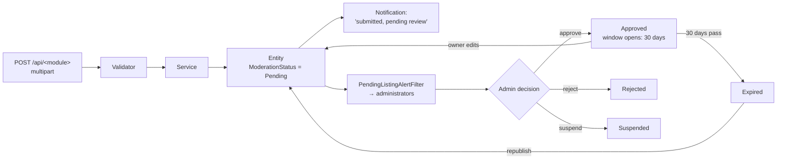

# Modules

[← README](../README.md) · Related: [API](API.md) · [BUSINESS_RULES](BUSINESS_RULES.md) · [DATABASE](DATABASE.md)

12 categories → 52 sub-categories → **48 concrete listing types**. This document explains how a
module actually works, starting with the pattern they all share.

---

## The standard listing module

Nearly every module is the same vertical slice. Learn it once.

### Files a module owns

| Concern | Location |
| --- | --- |
| Entity + images/selections | `Core/Domain/Entities/<Category>/<Module>.cs` |
| Table mapping, indexes, filters | `Infastrucre/Presitance/Configurations/<Category>/<Module>Configurations.cs` |
| Repository | `Infastrucre/Presitance/Repositories/<Module>Repository.cs` |
| Service | `Core/Services/<Category>/<Module>Service.cs` |
| Interfaces | `Core/ServicesAbstraction/I<Module>Repository.cs`, `I<Module>Service.cs` |
| Validators | `Core/Services/Validation/<Module>RequestValidators.cs` |
| Mapping profile | `Core/Services/Mapping/<Module>MappingProfile.cs` |
| DTOs | `Shared/DTOs/<Category>/<Module>/` |
| Enums | `Shared/Enums/<Category>/<Module>Enums.cs` |
| Arabic lookup names | `Shared/Constants/<Category>Catalog.cs` |
| Form schema | `Core/Services/AdForms/AdFormSchemaCatalog.cs` |
| Read routes | `Core/Services/ReadConfigs/ReadConfigCatalog.cs` |
| Controller | `Infastrucre/Presantion/Controllers/<Module>Controller.cs` |

### Endpoints a module publishes

| Method | Route | Auth | Purpose |
| --- | --- | --- | --- |
| `POST` | `/api/<module>` | user | Create — **multipart only** |
| `GET` | `/api/<module>` | anonymous | Paged, filtered, sorted list |
| `GET` | `/api/<module>/{id}` | anonymous | Details (counts a view) |
| `PUT` | `/api/<module>/{id}` | owner or admin | Update — sends back to review |
| `DELETE` | `/api/<module>/{id}` | owner or admin | Soft delete |
| `PUT` | `/api/<module>/{id}/images/order` | owner or admin | Reorder gallery |
| `PUT` | `/api/<module>/{id}/promotion` | **admin only** | مميز / بريميوم / بيع سريع |
| `GET` | `/api/<module>/{id}/similar` | anonymous | Similar listings |
| `GET` | `/api/<module>/{id}/related` | anonymous | Same owner, then same مركز |
| `GET` | `/api/<module>/recently-added` | anonymous | Newest strip |
| `GET` | `/api/<module>/<lookup-name>` | anonymous | One lookup list per route |

Real-estate and home-furnishing modules add `price-statistics` and `search-suggestions`.

Not every module has every row — check `GET /api/lookups/read-config/{cat}/{sub}`, which publishes
each module's actual read routes.

---

## Category 1 — سيارات (Cars) · subs 1–4

| | |
| --- | --- |
| **Sub-categories** | Private (1), Taxi (2), Motorcycles (3), Heavy Equipment (4) |
| **Endpoint** | `/api/ads` — one endpoint for all four |
| **Entity** | `Advertisement` (+ `AdvertisementImage`, `AdvertisementFeature`, `AdvertisementView`) |
| **Module type** | `ListingModuleType.Advertisement = 1` |

**The odd one out.** Cars is the only category still in the shared `Advertisements` table, and the
only moderated type that does **not** implement `IExpiringListing` — it had a richer publication
window of its own first, with an `AdvertisementStatus` column (`Pending`, `Active`, `Expired`,
`Deleted`) alongside the moderation status.

Consequences you must know:

- `AdvertisementService.GetByIdAsync` states the visibility rule **itself**, in three ordered
  refusals: soft delete (everybody, including the owner) → moderation (non-owner) → publication
  window (non-owner). Every other module gets that rule from `VisibleToViewer`.
- Video lives on the entity (`VideoPath` / `VideoUrl`), not in a separate row.
- `CarCatalog` owns all Arabic wording, and checkbox lists (`ChangedParts`, `UsageFields`,
  `RentSystems`) are flag columns rather than selection tables.
- `GET /api/ads/{id}` is polymorphic — `adType` in the response says which shape it is, because
  subs 9–14 (رجال أعمال) also live in this table.

> **رجال أعمال has two create paths.** A business listing can be created through
> `/api/suppliers` etc. **and** through `POST /api/ads` with sub-category 9–14. A field rule stated
> in only one of them is not enforced in the other.

---

## Category 2 — ورش وحرفيين (Workshops & Craftsmen) · subs 5–6

| | |
| --- | --- |
| **Endpoints** | `/api/workshops`, `/api/craftsmen` |
| **Entities** | `Workshop`, `Craftsman` (+ images) |
| **Lookups** | `WorkshopCraftsmenCatalog` — Arabic names and seeding |
| **Rules** | Images are **required**. Owner-or-admin edit/delete, soft delete |

> **FK rule:** no cascade from `AspNetUsers` (use `NoAction`). 48 cascading relationships into the
> Identity table produce SQL Server error 1785.

---

## Category 3 — المفقودات (Lost & Found) · subs 7–8

| | |
| --- | --- |
| **Endpoint** | `/api/lost-found` — **one route for both post types** |
| **Entity** | `LostFoundPost` (+ images, likes, comments) |
| **Module types** | `LostItem = 70`, `FoundItem = 71` |
| **Discriminator** | `PostType` (1 = ضايع مني, 2 = لقيت) — the create form's `defaultValue` differs per sub-category |

**Special behaviour**

- Has **likes and comments** (most modules do not). Comments support edit (author only) and delete
  (author or admin), with `canEdit` / `canDelete` on each comment.
- `PATCH .../mark-returned` — the owner marks a post as returned to its owner.
- Images are **optional** here.
- It records its own مشاهدة **inline** rather than through `ListingInteractionFilter`, because that
  filter resolves the module from the request path and both post types share one path. The inline
  call tolerates `NotFoundException` — see
  [BUSINESS_RULES § Owner visibility](BUSINESS_RULES.md#3-ownership-and-visibility).
- Counters are denormalised on the post.

---

## Category 4 — رجال أعمال (Business) · subs 9–14

| Sub | Endpoint | Entity |
| --- | --- | --- |
| 9 | `/api/factories` | `Factory` |
| 10 | `/api/farms` | `Farm` |
| 11 | `/api/companies` | `Company` |
| 12 | `/api/suppliers` | `Supplier` |
| 13 | `/api/wholesale-traders` | `WholesaleTrader` |
| 14 | `/api/fruit-vegetable-merchants` | `FruitVegetableMerchant` |

Each is fully independent — own tables, own module-owned enums and lookups. Those enums must **not**
be merged with the older shared `SupplierType` / `TradeType` / `SaleType`, which belong to the
legacy `/api/ads` path. `BusinessCatalog` seeds 8 lookups.

---

## Category 5 — الوظائف (Jobs) · subs 15–16

| Sub | Endpoint | Entity | Module type |
| --- | --- | --- | --- |
| 15 | `/api/job-requests` | `JobRequest` | 10 |
| 16 | `/api/job-opportunities` | `JobOpportunity` | 11 |

Two independent modules that **deliberately share** `JobField` and `JobExperienceLevel` lookups, per
specification.

**Uploads.** This category extends the upload pipeline beyond images:

| Kind | Formats | Max |
| --- | --- | --- |
| CV | PDF, DOC, DOCX | 10 MB |
| Introduction video | MP4, MOV | 50 MB |

A طلب عمل is the largest legitimate request body in the platform — 50 + 10 + 5 MB — which is why the
server-wide ceiling and the IIS limit are what they are ([PERFORMANCE](PERFORMANCE.md)).

---

## Category 6 — الحيوانات (Animals) · subs 17–25

Nine independent modules, **53 module-owned lookup tables**, `ListingModuleType` 20–28.

| Sub | Endpoint | Sub | Endpoint |
| --- | --- | --- | --- |
| 17 | `/api/livestock` | 22 | `/api/pets` |
| 18 | `/api/sheep-goats` | 23 | `/api/fish` |
| 19 | `/api/horses` | 24 | `/api/bees` |
| 20 | `/api/camels` | 25 | `/api/other-animals` |
| 21 | `/api/birds` | | |

Seams: `AnimalLookupItemDto`, `AnimalCatalog`, `AnimalFormLookups`.

---

## Category 7 — التحف والأنتيكات (Antiques) · subs 26–30

Five modules, 17 module-owned lookups, `ListingModuleType` 30–34.

`/api/decor-antiques` · `/api/antiques` · `/api/paintings` · `/api/handmade` · `/api/coins-stamps`

**Introduced the video-entity seam** — `IListingVideo` + a `ListingVideos` row (unlike سيارات, which
keeps video on the entity). Images are **required** on these forms.

---

## Category 8 — الملابس (Clothing) · subs 31–33

`/api/men-clothing` · `/api/women-clothing` · `/api/kids-clothing` — 18 module-owned lookups.

**Introduced the multi-select precedent:** sizes and colours are **composite-key selection tables**
(`(ListingId, Value)`), not columns. A "which listings come in red?" filter is then an index seek.
Shared rules live in `ClothingValidationRules`.

---

## Category 9 — التسوق أونلاين (Online Shopping) · subs 34–39

`/api/accessories` · `/api/cosmetics` · `/api/home-kitchen` · `/api/shopping-electronics` ·
`/api/gifts-toys` · `/api/homemade-food` — 17 lookups, `ListingModuleType` 38–43.

**No location block at all** — these are shipped goods. Per-module conditional rules:

| Module | Rule |
| --- | --- |
| Electronics | Warranty fields |
| Cosmetics | Expiry date |
| Homemade Food | Delivery areas |

---

## Category 10 — افرش بيتك (Home Furnishing) · subs 40–46

`/api/furniture` · `/api/furnishings-curtains` · `/api/lighting-decor` · `/api/kitchen-tools` ·
`/api/home-appliances` · `/api/bathroom-supplies` · `/api/plants-ornaments` —
`ListingModuleType` 50–56.

`PlantOrnament` alone has no colours or material. Conditional `LightType` and `WarrantyDuration`
rules apply where relevant.

---

## Category 11 — عقارات (Real Estate) · subs 47–49

| Sub | Endpoint | Entity | Module type |
| --- | --- | --- | --- |
| 47 | `/api/lands` | `Land` | 60 |
| 48 | `/api/apartments` | `Apartment` | 61 |
| 49 | `/api/shops` | `Shop` | 62 |

Three modules, **59 module-owned lookups**. The richest category — read `أراضي` first if you want to
understand what a module can do.

**أراضي (Land) in detail**

- 95 form fields, 22 lookup routes, 34 module endpoints.
- `ListingType` (بيع / إيجار / بدل) opens three different blocks of conditional fields; `LandType`
  opens either 🌾 بيانات الأرض الزراعية or 🏗 بيانات البناء, and the two sets are disjoint.
- `Utilities` and `RentInclusions` are composite-key selection tables.
- Video is optional; images are required (1–10).
- `price-statistics` and `search-suggestions` compute over the **same selection** the list endpoint
  would return, so the figures always describe the results beside them.

**The `RealEstateListings.Keep` seam** nulls a conditional field once its condition stops holding —
so a column can never hold an answer to a question the form no longer asks.

**`IX_Lands_Search`** is a covering index added for search, sorting and price statistics; see
[PERFORMANCE](PERFORMANCE.md#the-land-search-covering-index).

---

## Category 12 — بوابة الخيرات (Charity) · subs 50–52

| Sub | Endpoint | Entity |
| --- | --- | --- |
| 50 | `/api/rescues` | `Rescue` |
| 51 | `/api/blood-requests` | `BloodRequest` |
| 52 | `/api/ask-consults` | `AskConsult` |

All three inherit `CharityListing` (abstract), which implements `IModeratedListing, IExpiringListing`
and carries `UserId`. They are served by a **generic** `CharityRepositoryBase<TListing, TFilter>` —
one repository file for three modules.

**Distinctive rules**

- A `location` form-field type: a map pin the form fans out into `Latitude` / `Longitude`
  (`writesFields`).
- `IsResponsibilityAccepted` — a **required checkbox**. إقرار المسؤولية must be `true` or the create
  is refused.
- اسأل واستشير has **likes and comments**; the other two do not.
- **اسأل واستشير has no location** — governorate, مركز, latitude and longitude were removed from six
  layers. Rescue and Blood Requests keep theirs. The columns remain for old rows.
- `approvedAt` is `PublishedAt`.

---

## Cross-module features

These are not categories; they act on a listing of **any** module via
`(type: ListingModuleType, id: Guid)`.

| Feature | Route | Notes |
| --- | --- | --- |
| Views | `POST /api/advertisements/{id}/view` | Deduplicated (6 h default); the owner's own views never count |
| Recently viewed | `GET/DELETE /api/advertisements/recently-viewed` | One entry per listing, 100 retained |
| Favourites | `POST/DELETE /api/advertisements/{id}/favorite` | Idempotent — a double tap is not a 500 |
| Ratings | `POST/GET/DELETE /api/advertisements/{id}/rating` | 1–5 stars, one per `(type, id, user)`; a second rating replaces the first |
| Reports | `POST /api/advertisements/{id}/report` | ⚠️ takes `type` in the **body**, not the query |
| Republish | `POST /api/advertisements/{id}/republish` | Reuses the row, returns it to Pending |
| Similar | `GET /api/advertisements/{id}/similar` | |
| Actions | `GET /api/advertisements/{id}/actions` | What the caller may do with this listing |

The `type` query parameter defaults to `Advertisement` (1), which is what keeps the pre-existing
سيارات clients working without sending it.

---

## Supporting modules

| Module | Routes | Purpose |
| --- | --- | --- |
| **Auth** | `/api/auth/*` | Register, login, refresh, logout, password reset |
| **Profile** | `/api/profile/*` | Profile, avatar upload, `my-listings` (all modules), statistics, expired ads, password change |
| **Notifications** | `/api/notifications/*` | List, unread count, mark read, delete, preferences, **interests** (اهتماماتي) |
| **Lookups** | `/api/lookups/*` | `create-ad-form`, `read-config`, categories tree, governorates, centers |
| **Payments** | `/api/payments/*` | Manual payments — screenshot upload, always created Pending |
| **Banner bookings** | `/api/banner-bookings/*`, `/api/banner-advertisements` | Advertisers book placements; **not** a listing module |
| **Referrals** | `/api/referrals/*` | Invite codes and links; one referrer per account |
| **Home** | `/api/home` | Composed home page |
| **Admin V2** | `/api/v2/admin/*` | The dashboard — see [AUTHORIZATION](AUTHORIZATION.md) |

`my-listings` is extensible: a module appears there by implementing `IUserListingSource`.
